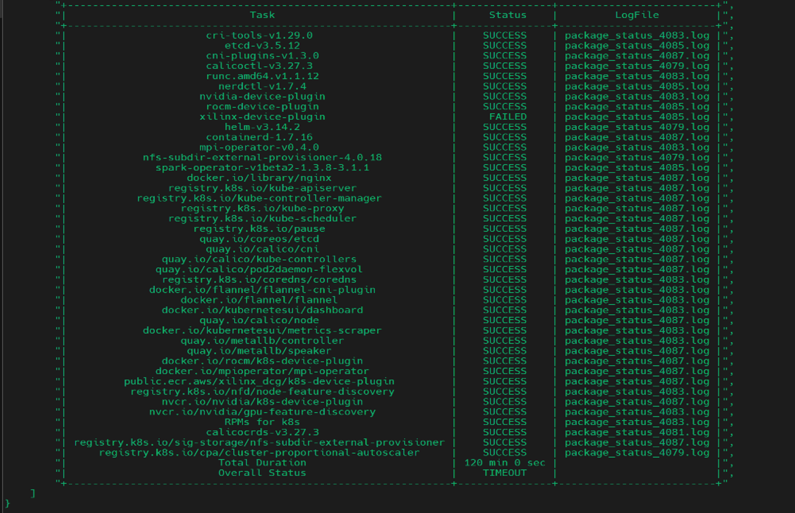
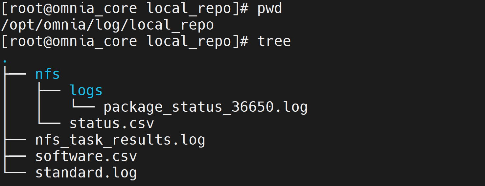

================================
Execute the local repo playbook
================================

The local repository playbook (``local_repo.yml``) downloads and saves the software packages/images to the **Pulp container**, which all the cluster nodes can access.

Configurations made by the playbook
=======================================

    * With ``repo_config`` set to ``always`` in ``/opt/omnia/input/project_default/config/software_config.json``, all images and artifacts will be downloaded to the Pulp container present on the NFS share.

    * If  ``repo_config`` is set to ``always``, the OIM serves as the default Pulp registry.

Playbook execution
=====================

To create local repositories on the Pulp container, execute the ``local_repo.yml`` playbook using the following command: ::

    ssh omnia_core
    cd /omnia/local_repo
    ansible-playbook local_repo.yml

Metadata report
===================

After a successful execution of the ``local_repo.yml`` playbook, a metadata file called ``localrepo_metadata.yml`` is created under the ``/opt/omnia/offline_repo/.data/`` directory. 
This file captures the ``repo_config`` (``always``, ``partial``, or ``never``) details provided during the playbook execution. 
If the ``local_repo.yml`` playbook is re-run, it compares the current repository policy with the previously captured metadata. Based on this, there can be two scenarios:

    * If a change in policy is detected, you will be prompted to confirm whether to proceed with the updated configuration or not.

        * If you agree, the playbook continues with the updated policy and after successful execution, it updates the metadata file with the new repository policy.
        * If you decline, the playbook execution is aborted and the metadata file remains unchanged.

    * If there is no change in policy, the playbook execution proceeds without prompting. The metadata file remains unchanged.
         
Check status of the packages
===============================

After ``local_repo.yml`` has been executed, a status report is displayed containing the status for each downloaded package along with the complete playbook execution time. Here's an example of what that might look like:

**SUCCESS**: The package has been successfully downloaded to the Pulp container.

**FAILED**: The package couldn't be downloaded successfully.

.. note::

    * The ``local_repo.yml`` playbook execution fails if any software package has a ``FAILED`` status. In such a scenario, the user needs to re-run the ``local_repo.yml`` playbook.

    * If any software package fails to download during the execution of this playbook, other scripts/playbooks that rely on the package may also fail.

    * To download additional software packages after the playbook has been executed, simply update the ``/opt/omnia/input/project_default/software_config.json`` with the new software information and re-run the ``local_repo.yml`` playbook.

Log files
===========

The ``local_repo.yml`` playbook generates and provides two types of log files as part of its execution:

1. ``standard.log``: This log file is present in the ``/opt/omnia/log/local_repo`` directory, and contains the overall status of the ``local_repo.yml`` playbook execution.

2. **Package based logs**: Each package download initiated by the ``local_repo.yml`` playbook comes with its own log file. These log files can be accessed from ``/opt/omnia/log/local_repo``.

.. note:: To view the log files in ``.csv`` format, navigate to ``/opt/omnia/log/local_repo/status.csv``.

Here's an example of how the log files are organized in the ``/opt/omnia/log/local_repo`` directory:

Updating local repositories after modifying JSON files
==========================================================

After the execution of the ``local_repo.yml`` playbook is complete, any modifications made to a ``<software_name>.json`` file (for example, ``k8s.json``, ``slurm.json``, ``additional_software.json``) will **not** be reflected in the local repositories automatically.
To apply the changes, you must **re-run the** ``local_repo.yml`` **playbook** while explicitly specifying the updated software names using the ``softwares`` argument.

Command format
--------------

::

   ansible-playbook local_repo.yml -e "softwares=<comma-separated list of software names>"

Examples
---------

* If you modified ``service_k8s.json``: ::

    ansible-playbook local_repo.yml -e "softwares=k8s"

* If you modified multiple ``.json`` files, such as ``service_k8s.json`` and ``slurm.json``: ::

    ansible-playbook local_repo.yml -e "softwares=k8s,slurm"

* If you updated ``additional_software.json`` with a few additional packages of your choice: ::

    ansible-playbook local_repo.yml -e "softwares=additional_software"

.. note:: When specifying software names, omit the ``.json`` extension.

**[Optional]** `Update all local repositories <update_local_repo.html>`_
===========================================================================