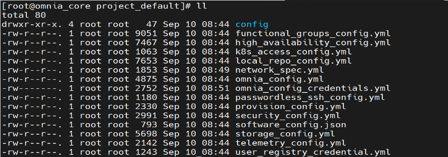

===========================================================================
Step 4: Provide inputs to the files in the ``project_default`` directory
===========================================================================

Omnia is now deployed using a project-based approach. Once the ``omnia_core`` container is deployed, all the input files needed for the cluster will be available in the ``/opt/omnia/input/project_default`` directory on the NFS share.
Before moving on to the next step, which is running the ``prepare_oim.yml`` playbook, you must provide inputs for all the files in this directory.

Here's an example of the input files present in the ``project_default`` directory:

Input Validator
=================

Once all the input files are filled, the input validator can be used to verify if the provided inputs are correct or not.
This helps reduce execution delays at runtime caused by wrong inputs. Use the following command to execute the input validator: ::

    cd input_validation
    ansible-playbook validate_config.yml