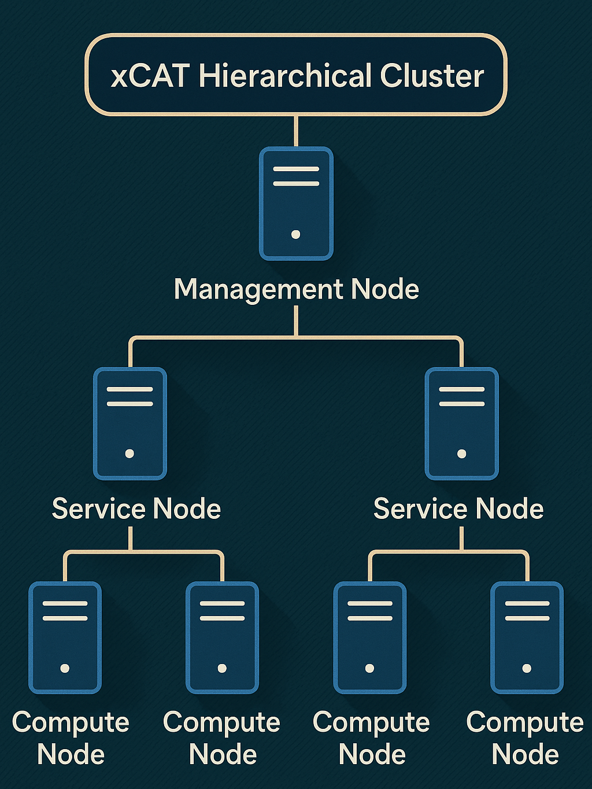

Step 3: Hierarchical Cluster
==================================

In order to manage large-sized clusters, Omnia helps to create a hierarchical cluster based on user inputs. A **hierarchical cluster** organizes nodes in layers, with a central **Management Node (MN)** overseeing multiple **Service Nodes (SN)**, each managing a group of compute nodes. 
To know more, `click here <https://xcat-docs.readthedocs.io/en/stable/advanced/hierarchy/index.html>`_.

A typical hierarchical cluster consists of:

* **Management Node**: The top-level node that oversees the entire cluster.

* **Service Nodes**: Intermediate nodes that manage groups of compute nodes. These handle hardware provisioning, OS-deployment, monitoring, and commands for their assigned nodes.

* **Compute Nodes**: The actual worker nodes of the cluster.

Prerequisites
--------------

1. Ensure that the ``/opt/omnia/input/project_default/software_config.json`` file contains ``{"name": "service_node"}`` under the ``softwares`` list. ::

    "softwares": [
        
        {"name": "service_node"},
    ]

2. Omnia supports hierarchical cluster formation only when ``service_node`` role is defined in ``roles_config.yml`` input file under the ``/opt/omnia/input/project_default/`` directory. If ``service_node`` role is not defined then all nodes will be provisioned from the OIM. For more information, `click here <composable_roles.html>`_.

3. To support hierarchical provisioning, all the SNs (active or passive) should be in booted state.

Playbook execution
-------------------

A complete hierarchical cluster can be provisioned with two consecutive runs of the ``discovery_provision.yml`` playbook. Follow the below steps to set up the management layer (OIM, SN, Login Node, Auth server) first and then the compute nodes.

1. To set up the management layer (OIM, SN, Login Node, Auth server), run the ``discovery_provision.yml`` playbook with ``management_layer`` tag. ::

    ansible-playbook discovery_provision.yml --tags "management_layer"

2. To set up the compute nodes, run the ``discovery_provision.yml`` playbook without any specified tags. ::

    ansible-playbook discovery_provision.yml

[Optional] High Availability
--------------------------------

Omnia also supports HA functionality for the ``OIM``, ``service_node``, and ``kube_control_plane`` of the management layer. If you want HA functionality along with your hierarchical cluster, fill up the necessary parameters in the ``high_availability_config.yml`` config file present in the ``/opt/omnia/input/project_default/`` directory. For more information, `click here <HighAvailability/index.html>`_.

.. note:: 
    
    * In a hierarchical cluster setup, an external NFS share must be used for the Omnia shared path.
    * If you want to use HA functionality, ensure that all the nodes (active or passive) are in booted state.

