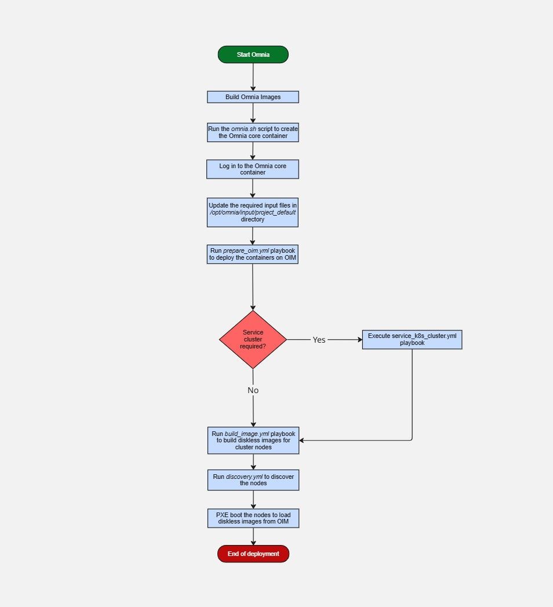

Omnia Deployment Guide
=========================

* `Deploy Omnia container on RHEL platforms <RHEL_new/index.html>`_

* `Advanced Configurations <AdvancedConfigurations/index.html>`_

* `Maintenance <Maintenance/index.html>`_

* `Sample Files <samplefiles.html>`_

.. toctree::
    :hidden:

    RHEL_new/index
    AdvancedConfigurations/index
    Maintenance/index
    samplefiles
