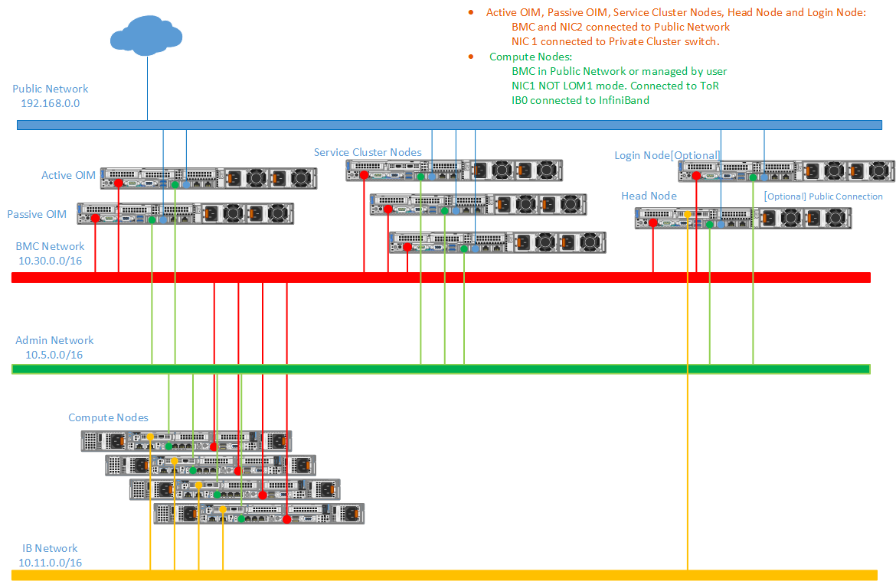

Network Topology: Dedicated Setup
====================================

.. note:: The following diagram is for representational purposes only.

In a **Dedicated Setup**, all the cluster nodes (Head, Compute, and Login [optional]) have dedicated iDRAC connection.

* **Public Network (Blue line)**: This indicates the external public network which is connected to the internet. NIC2 of the OIM, Service cluster nodes, Head node, and Login node [optional] is connected to the public network.

* **BMC Network (Red line)**: This indicates the private BMC (iDRAC) network used by the OIM to control the cluster nodes using out-of-band management.

* **Admin Network (Green line)**: This indicates the admin network utilized by Omnia to provision the cluster nodes. NIC1 of all the nodes are connected to the private switch.

* **IB / Additional Ethernet Network (Yellow line)**: This indicates the Infiniband (IB) or the additional ethernet network used by applications on the cluster nodes to communicate among each other, using Mellanox or high-speed ethernet switch. OIM connectivity is optional for this switch.

.. note:: Omnia supports classless IP addressing, which allows the Admin network, BMC network, Public network, and the Additional network to be assigned different subnets. However, the Admin and BMC networks must be on the same subnet (represented by the ``netmask_bits`` parameter in the ``/opt/omnia/input/project_default/network_spec.yml`` file).

**Recommended discovery mechanism**

* `mapping <../../OmniaInstallGuide/RHEL_new/Provision/DiscoveryMechanisms/mappingfile.html>`_
* `bmc <../../OmniaInstallGuide/RHEL_new/Provision/DiscoveryMechanisms/bmc.html>`_

