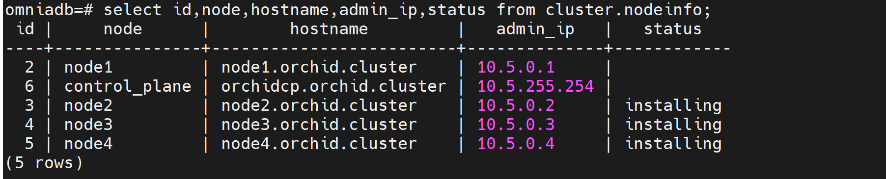
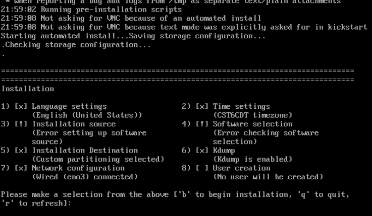

Provision
==========

⦾ **Why does the provisioning status of RHEL remote servers remain stuck at ‘installing’ in** ``cluster.nodeinfo`` **table (omniadb)?**

.. csv-table::
   :file: ../../../Tables/FAQ_provision.csv
   :header-rows: 1
   :keepspace:

