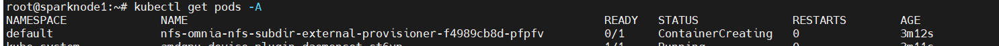
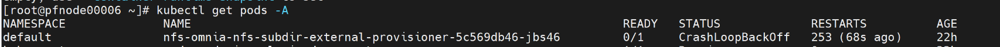
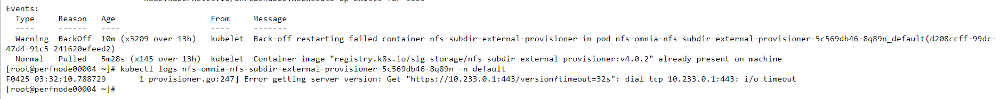
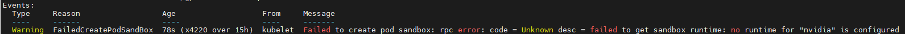

Kubernetes
===========

⦾ **Why do Kubernetes Pods show** ``ImagePullBackOff`` **or** ``ErrImagePull`` **errors in their status?**

**Potential Cause**: The errors occur when the Docker pull limit is exceeded.

**Resolution**:

    * Ensure that the ``docker_username`` and ``docker_password`` are provided in ``input/provision_config_credentials.yml``.

    * During ``omnia.yml`` execution, a kubernetes secret Docker ``regcred`` will be created in default namespace and patched to the Docker service account. To avoid ``ErrImagePull`` issue, you need to patch this secret to your namespace while deploying custom applications and use this secret as ``ImagePullSecrets`` in the yaml file . `Click here for more info. <https://kubernetes.io/docs/tasks/configure-pod-container/pull-image-private-registry>`_

.. note:: If the playbook is already executed and the pods are in **ImagePullBackOff** state, run ``kubeadm reset -f`` on all the nodes before re-executing the playbook with the Docker credentials.

⦾ **What to do if the nodes in a Kubernetes cluster reboot?**

**Resolution**: Wait for 15 minutes after the Kubernetes cluster reboots. To verify the status of the cluster nodes, run the following commands from the ``kube_control_plane``:

1. To get real-time kubernetes cluster status, run: ::
    
    kubectl get nodes

2. To check which the pods are in the **Running** state, run: ::
    
    kubectl get pods  all-namespaces 

3. To verify that both the kubernetes master and kubeDNS are in **Running** state, run: ::
    
    kubectl cluster-info 

⦾ **What to do when the Kubernetes services are not in** ``Running`` **state?**

**Resolution**:

1. Run ``kubectl get pods  all-namespaces`` to get the status of all the pods.

2. If the pod(s) are not in ``Running`` state, delete it using the command: ``kubectl delete pods <name of pod>``

3. Re-run the ``omnia.yml``or ``scheduler.yml`` playbook to bring up Kubernetes on the previously failed pods.

⦾ **If the DNS servers are unresponsive, the Kubernetes pods stop communicating with the servers.**

**Potential Cause**: The host network is faulty causing DNS to be unresponsive.

**Resolution**:

1. In your Kubernetes cluster, run ``kubeadm reset -f`` on all the nodes.

2. On the management node, edit the ``omnia_config.yml`` file to change the Kubernetes Pod Network CIDR. The suggested IP range is 192.168.0.0/16. Ensure that the IP provided is not in use on your host network.

3. List ``k8s`` in ``input/software_config.json`` and re-run ``omnia.yml``.

⦾ **Why does the** ``TASK: Initialize Kubeadm`` fail with ``nnode.Registration.name: Invalid value: "<Host name>"`` **error?**

**Potential Cause**: The OIM does not support hostnames with an underscore in it, such as 'mgmt_station'.

**Resolution**: Ensure that the OIM hostname meets the below mentioned requirements:

    .. include:: ../../../Appendices/hostnamereqs.rst

⦾ **What to do if** ``omnia.yml`` **playbook execution fails with MetalLB, a load-balancer for bare metal Kubernetes cluster?**

**Potential Cause**: This failure is caused due to an issue with Kubespray, a third-party software. For more information about this issue, `click here <https://github.com/kubernetes-sigs/kubespray/issues/11847>`_.

**Resolution**: If your ``omnia.yml`` playbook execution fails while waiting for the MetalLB controller to be up and running, you need to wait for the MetalLB pods to come to running state and then re-run ``omnia.yml/scheduler.yml``.

⦾ **Why does the NFS-client provisioner go to a** ``ContainerCreating`` **or** ``CrashLoopBackOff`` **state?**

**Potential Cause**: This issue usually occurs when ``server_share_path`` given in ``storage_config.yml`` for ``k8s_share`` does not have an NFS server running.

**Resolution**:

    * Ensure that ``storage.yml`` is executed on the same inventory which is being used for ``scheduler.yml``.
    * Ensure that ``server_share_path`` mentioned in ``storage_config.yml`` for ``k8s_share: true`` has an active nfs_server running on it.

⦾ **If the Nfs-client provisioner is in** ``ContainerCreating`` **or** ``CrashLoopBackOff`` **state, why does the** ``kubectl describe <pod_name>`` **command show the following output?**

**Potential Cause**: This is a known issue. For more information, click `here. <https://github.com/helm/charts/issues/23743>`_

**Resolution**:

    1. Wait for some time for the pods to come up. **or**
    2. Do the following:

        * Run the following command to delete the pod: ::

            kubectl delete pod <pod_name> -n <namespace>

        * Post deletion, the pod will be restarted and it will come to running state.

⦾ **Why does the nvidia-device-plugin pods in** ``ContainerCreating`` **status fail with a** ``no runtime for "nvidia" is configured`` **error?**

**Potential Cause**: nvidia-container-toolkit is not installed on GPU nodes.

**Resolution**: Install Kubernetes, download nvidia-container-toolkit, and perform the necessary configurations based on the OS running on the cluster.

⦾ **After running the** ``reset_cluster_configuration.yml`` **playbook on a Kubernetes cluster, which should ideally delete all Kubernetes services and files, it is observed that some Kubernetes logs and configuration files are still present on the** ``kube_control_plane``. **However, these left-over files do not cause any issues for Kubernetes re-installation on the cluster. The files are present under the following directories:**

* ``/var/log/containers/``
* ``/sys/fs/cgroup/``
* ``etc/system``
* ``/run/systemd/transient/``
* ``/tmp/releases``

**Potential Cause**: When ``reset_cluster_configuration.yml`` is executed on a Kubernetes cluster, it triggers the Kubespray playbook ``kubernetes_sigs.kubespray.reset`` internally, which is responsible for removing Kubernetes configuration and services from the cluster. However, this Kubespray playbook doesn't delete all Kubernetes services and files, resulting in some files being left behind on the ``kube_control_plane``.

**Workaround**: After running the ``reset_cluster_configuration.yml`` playbook on a Kubernetes cluster, users can choose to remove the files from the directories mentioned above if they wish to do so.