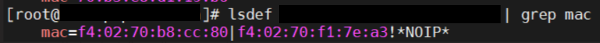

Provision
==========

⦾ **Why doesn't my newly discovered server list a MAC ID in the** ``cluster.nodeinfo`` **table?**

**Potential Cause**: Due to internal MAC ID conflicts on the target nodes, the MAC address will be listed against the target node using this format ``MAC ADDRESS 1 | MAC ADDRESS 2! *NOIP*`` in the xCAT node object.

**Resolution**: Follow the below steps to resolve this issue:

    1. Establish a SSH connection to the ``omnia_core`` container using the following command: ::

        ssh omnia_core

    2. Establish a SSH connection to the ``omnia_provision`` container from inside the ``omnia_core`` container using the following command: ::

        ssh omnia_provision

    3. Execute the ``lsdef`` command from the ``omnia_provision`` container.

⦾ **Why are some target servers not reachable after PXE booting them?**

**Potential Causes**:

1. The server hardware does not allow for auto rebooting

2. The process of PXE booting the node has stalled.

**Resolution**:

1. Login to the iDRAC console to check if the server is stuck in boot errors (F1 prompt message). If true, clear the hardware error or disable POST (PowerOn Self Test).

2. Hard-reboot the server to bring up the server and verify that the boot process runs smoothly. (If it gets stuck again, disable PXE and try provisioning the server via iDRAC.)

⦾ **Why does PXE boot fail with tftp timeout or service timeout errors?**

**Potential Causes**:

* RAID is configured on the server.

* Two or more servers in the same network have xCAT services running.

* The target cluster node does not have a configured PXE device with an active NIC.

**Resolution**:

* Create a Non-RAID or virtual disk on the server.

* Check if other systems except for the OIM have ``xcatd`` running. If yes, then stop the xCAT service using the following commands: ``systemctl stop xcatd``.

* On the server, go to **BIOS Setup -> Network Settings -> PXE Device**. For each listed device (typically 4), configure an active NIC under ``PXE device settings``

⦾ **The** ``discovery_provision.yml`` **playbook fails to check for duplicate** ``disk_partition`` **values in** ``input/provision_config.yml`` **.**

**Resolution**: User needs to ensure that there are no duplicate entries for the same partition in provision_config.yml.

⦾ **After executing** ``disocvery_provision.yml`` **, why is the node status in OmniaDB being displayed as** ``standingby`` **?**

**Resolution**: For any discovery mechanism other than switch-based, do the following:

    1. Establish a SSH connection to the ``omnia_core`` container using the following command: ::

        ssh omnia_core

    2. Establish a SSH connection to the ``omnia_provision`` container from inside the ``omnia_core`` container using the following command: ::

        ssh omnia_provision
    
    3. Execute the following command: ::

        chdef <node> status=””

    4. Then run: ::

        rinstall <node>

    *Where ``<node>`` refers to the node column in the OmniaDB, which has a ``standingby`` status.*

⦾ **Why does the** ``discovery_provision.yml`` **playbook execution fail at task:** ``prepare_oim needs to be executed`` **?**

**Potential Cause**: The ``omnia_provision`` container is not up and running.

**Resolution**: Perform a cleanup using ``oim_cleanup.yml`` and re-run the ``prepare_oim.yml`` playbook to bring up the ``omnia_provision`` container. After ``prepare_oim.yml`` playbook has been executed successfully, re-deploy the cluster using the steps mentioned in the `Omnia deployment guide <../../../OmniaInstallGuide/RHEL_new/index.html>`.