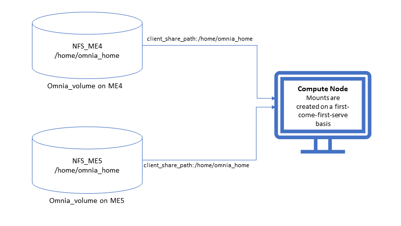

Storage
========

⦾ **Why does the** ``TASK: nfs_client: Mount NFS client`` **fail with the** ``Failed to mount NFS client. Make sure NFS Server is running on IP xx.xx.xx.xx`` **error?**

**Potential Cause**: The required services for NFS may not have been running:

    - nfs
    - rpc-bind
    - mountd

**Resolution**: Enable the required services using ``firewall-cmd  --permanent  --add-service=<service name>`` and then reload the firewall using ``firewall-cmd  --reload``.

⦾ **What to do when** ``omnia.yml`` **execution fails with the** ``nfs-server.service might not be running on NFS Server. Please check or start services`` **error?**

**Potential Cause**: nfs-server.service is not running on the target node.

**Resolution**: Use the following commands to bring up the service: 

    * To enable the service: ::
        
        systemctl enable nfs-server.service
        
    * To start the service: ::
        
        systemctl start nfs-server.service

⦾ **Why does the** ``TASK: nfs_client: Mount NFS client`` **fail with the message:** ``No route to host`` **?**

**Potential Cause**: There's a mismatch in the NFS share path mentioned in ``/etc/exports`` and ``storage_config.yml`` under ``nfs_client_params``.

**Resolution**: Ensure that the input paths are a perfect match to avoid any errors.

⦾ **Why is my NFS mount not visible on the client?**

**Potential Cause**: The directory being used by the client as a mount point is already in use by a different NFS export.

**Resolution**: Verify that the directory being used as a mount point is empty by using ``cd <client share path> | ls`` or ``mount | grep <client share path>``. If empty, re-run the playbook.

⦾ **Why does the** ``BeeGFS-client`` **service fail?**

**Potential Causes**:

1. SELINUX may be enabled. (Use ``sestatus`` to check)

2. Ports 8008, 8003, 8004, 8005, and 8006 may be closed. (Use ``systemctl status beegfs-mgmtd, systemctl status beegfs-meta, systemctl status beegfs-storage`` to check)

3. The BeeGFS set up may be incompatible with the RHEL version running on the cluster.

**Resolutions**:

1. If SELinux is enabled, update the file ``/etc/sysconfig/selinux`` and reboot the server.

2. Open all ports required by BeeGFS: 8008, 8003, 8004, 8005 and 8006

3. Check the `support matrix <../../../Overview/SupportMatrix/OperatingSystems/index.html>`_  to ensure that a supported RHEL OS version is running on the cluster.

4. For further insight into the issue, check out ``/var/log/beegfs-client.log`` on nodes where the BeeGFS client is running.

⦾ **What to do if NFS clients are unable to access the share after an NFS server reboot?**

Reboot the NFS server (external to the cluster) to bring up the services again: ::

    systemctl disable nfs-server
    systemctl enable nfs-server
    systemctl restart nfs-server